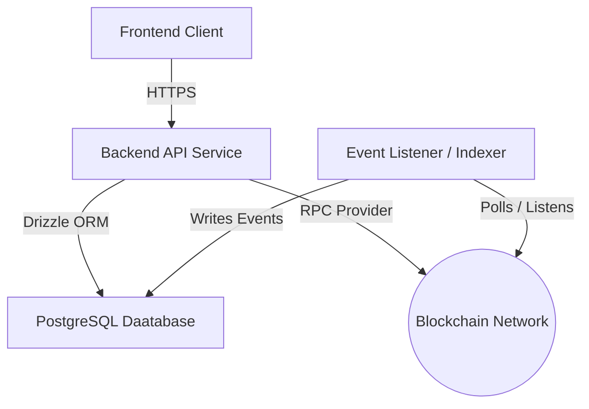

# Backend Architecture & Database Source of Truth

This document serves as the 'Source of Truth' for the backend architecture.

---

## 1. System Topology Overview

The backend handles the communication between the client, PostgreSQL as database layer, and the blockchain network.

## 2. Database Schema and Entity Relationships

The data layer is managed using Drizzle ORM connected to PostgreSQL. All primary identifiers are randomly generated UUIDs.
   
   **NOTE**: relationships between escrows and users are tracked via the public cryptographic wallet string/address instead of the randomly generated internal database uuid. This allows direct, seamless  off-chain verficiation of on-chain entities without looking up surrogate IDs.

### ERD 
   erDiagram
    users {
        uuid id PK
        text address UK "Not Null"
        timestamp created_at "Default: Now"
    }

    refresh_tokens {
        uuid id PK
        uuid user_id FK "On Delete: Cascade"
        text token "Hashed Refresh Token"
        timestamp expires_at
        boolean revoked "Default: false"
        created_at timestamp
    }

    escrows {
        uuid id PK
        text buyer FK "Matches users.address"
        text seller FK "Matches users.address"
        numeric amount "Precision 20, Scale 8"
        text token_symbol
        text description
        numeric fixed_fee "Precision 20, Scale 8"
        text state "Default: 'pending'"
        timestamp created_at
        timestamp updated_at
    }

    escrow_events {
        uuid id PK
        uuid escrow_id FK "On Delete: Cascade"
        text type "e.g., DEPOSIT, RELEASE"
        text state "State snapshot at event time"
        timestamp occurred_at
        text metadata "Optional JSON/String log"
    }

    users ||--o{ refresh_tokens : "authenticates"
    users ||--o{ escrows : "acts as buyer"
    users ||--o{ escrows : "acts as seller"
    escrows ||--o{ escrow_events : "tracks history"
   