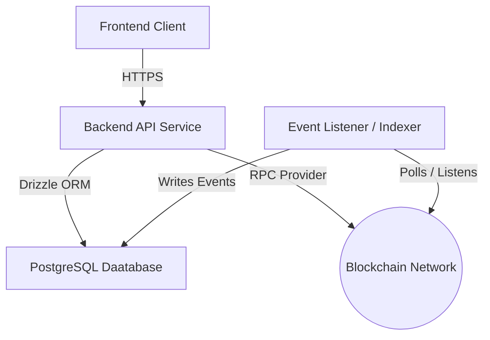
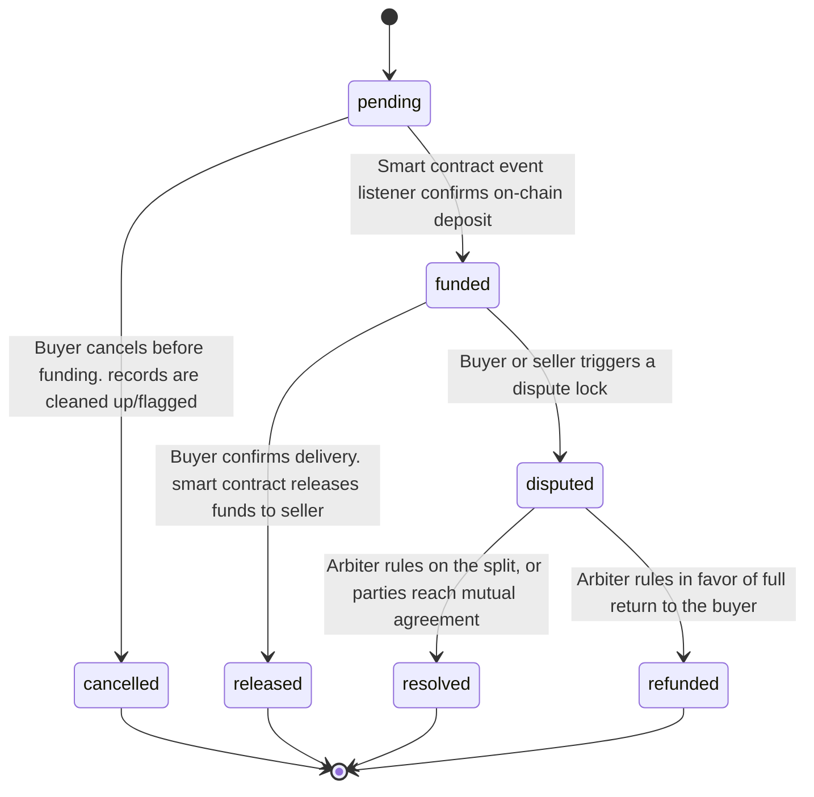

# Backend Architecture & Database Source of Truth

This document serves as the 'Source of Truth' for the backend architecture.

---

## 1. System Topology Overview

The backend handles the communication between the client, PostgreSQL as database layer, and the blockchain network.

## 2. Database Schema and Entity Relationships

The data layer is managed using Drizzle ORM connected to PostgreSQL. All primary identifiers are randomly generated UUIDs.
   
   **NOTE**: relationships between escrows and users are tracked via the public cryptographic wallet string/address instead of the randomly generated internal database uuid. This allows direct, seamless  off-chain verficiation of on-chain entities without looking up surrogate IDs.

### ERD 

## 3. The Escrow State Machine
Escrow business logic depends strictly on state updates. The state field in both escrows and escrow_events tables must adhere to the following transition constraints: 

## 4. Database Naming
All future database column and attributes definition should follow the snake_case convention(user_id, escrow_events, created_at). On the other hand, CamelCase is handled inside the application layer via Drizzle ORM config properties.
