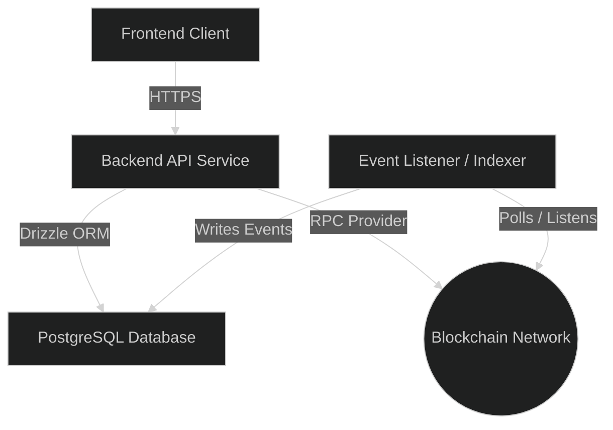
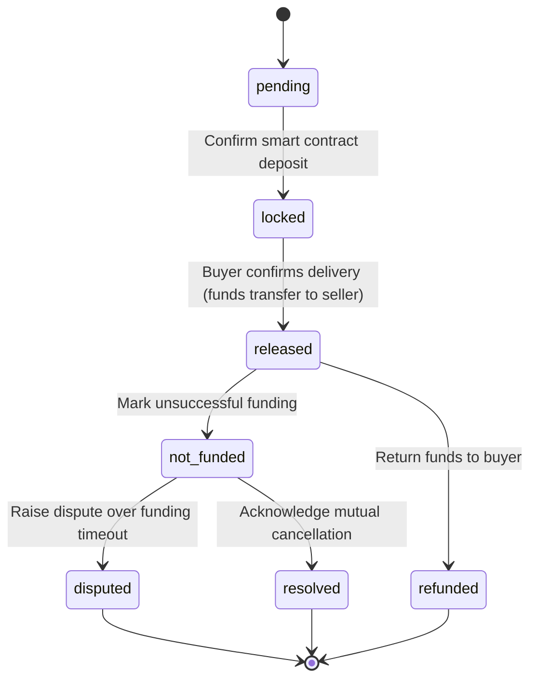

# Backend Architecture

This document describes the system topology, database design patterns, and the escrow state machine.

## 1. System Topology

The backend application bridges the frontend client, the PostgreSQL database, and the Sidrachain network:

## 2. Database Schema Guidelines

The database layer follows these implementation patterns:

- **ORM**: Configure and execute all queries using Drizzle ORM.
- **Primary Keys**: Generate random UUIDs for all table primary identifiers.
- **Foreign Keys & Verification**:
  - Relate user profiles to escrows using public cryptographic wallet addresses instead of database UUIDs.
  - This pattern allows off-chain services to verify transactions without mapping surrogate identifiers.
- **Database Column Naming**: Use `snake_case` naming conventions for database tables and columns.
- **Application Naming**: Map database attributes to `camelCase` identifiers in the NestJS application layer via the Drizzle configuration.

## 3. Escrow State Machine Transitions

Update escrow and event records only according to the following state constraints:

